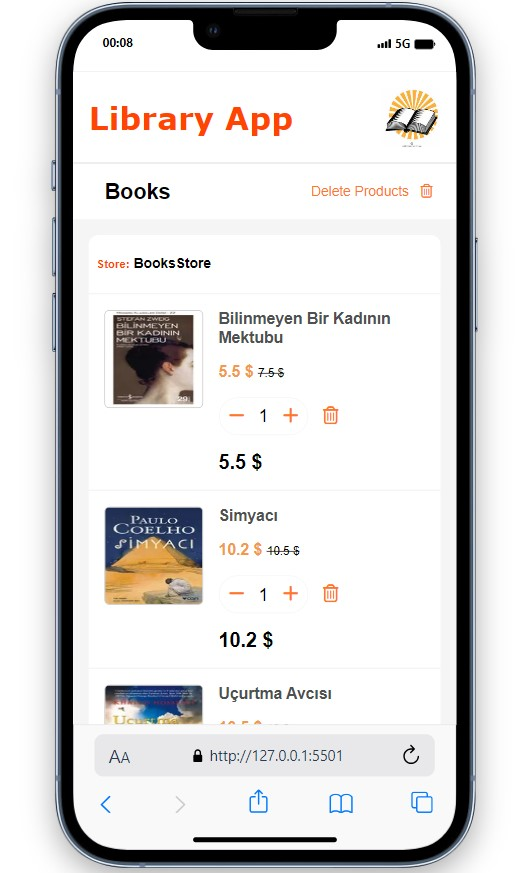
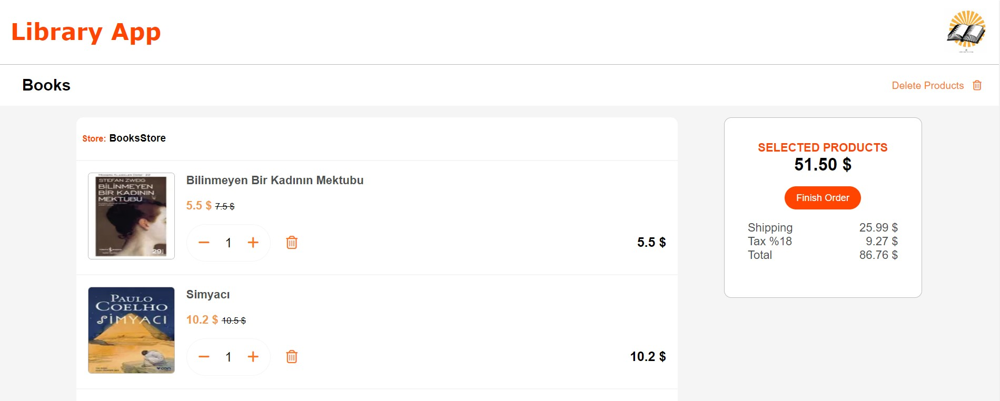

# Library App Checkout

This project implements a checkout system for a library app where users can purchase books. The checkout system calculates the total price, including discounts, taxes, and shipping costs, and allows users to manage their cart by adding, removing, and adjusting the quantity of items.

## Technologies Used

- HTML5
- CSS3
- JavaScript

## Features

- **Product List**: Display a list of available books with images, titles, prices, and quantity controls.
- **Delete Products**: Allow users to remove products from their cart.
- **Total Calculation**: Calculate the total price of the selected products, including discounts, taxes, and shipping costs.
- **Responsive Design**: Ensure the application works well on various screen sizes.

## How to Use

1. Clone the repository to your local machine.
2. Open the `index.html` file in your web browser.
3. Browse through the available books and add them to your cart.
4. Adjust the quantity of items or remove them as needed.
5. Review the total price and proceed to checkout.

## Project Structure

- `index.html`: Main HTML file that displays the checkout interface.
- `css/index.css`: CSS file containing styles for the checkout interface.
- `checkout2.js`: JavaScript file containing the logic for managing the cart and calculating prices.

## Screenshots

## Live Demo

[Live Demo](https://check-out-iota.vercel.app/)

## Author

[Your Name](https://github.com/Mehmet-github06)

Feel free to contribute to this project by submitting bug reports or feature requests.

 

 ⌛ Happy Coding  ✍ 

